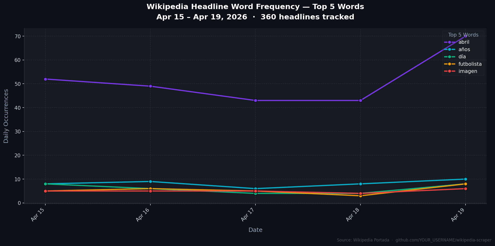

# Wikipedia Headline Scraper & Analyzer CLI

> A modular Python CLI tool that scrapes Wikipedia's front page, exports headlines to CSV, and performs automated word-frequency analysis — built with real-world engineering practices.

---

## Description

**Wikipedia Headline Scraper & Analyzer** is a command-line data pipeline that:

1. **Scrapes** Wikipedia's Spanish front page using `requests` + `BeautifulSoup`
2. **Exports** all extracted headlines to a structured CSV file
3. **Analyzes** word frequency across headlines, filtering Spanish stopwords, and surfaces the most relevant terms of the day

The tool was built with a focus on **modularity**, **reproducibility**, and **clean CLI ergonomics** using [Typer](https://typer.tiangolo.com/) with [Rich](https://github.com/Textualize/rich) for beautiful terminal output.

---

## Key Features

| Feature | Details |
|---|---|
| 🏗️ **Modular Architecture** | Logic split into `fetcher`, `storage`, `analyzer`, and `visualizer` modules under a clean `scraper/` package |
| ⚙️ **Typer CLI** | Two commands (`run`, `visualize`) with `--url`, `--top`, `--output`, `--plot`; range validation; built-in `--help` |
| 🧹 **Automated Data Cleaning** | Regex-based tokenization, Spanish stopword filtering, and minimum token-length threshold |
| 📄 **Append-Mode CSV** | `storage.py` appends new rows on every run — headlines accumulate over time for historical analysis |
| 📈 **Time-Series Visualization** | `visualizer.py` reads the full history, pivots by (date, word), and generates a styled dark-theme PNG chart |
| 📊 **Rich Terminal Output** | Colored tables, progress spinners, Unicode bar charts — all rendered via the `rich` library |
| 🔁 **Configurable Pipeline** | Every parameter (URL, output file, top-N count, plot toggle) is overridable from the command line |

---

## Engineering Highlights

### 🔍 Dynamic Selector Discovery

Wikipedia's HTML structure does not match commonly documented CSS selectors (e.g., the frequently cited `#mp-itn` does not exist on the Spanish portal). Rather than hardcoding selectors based on assumptions, a **diagnostic introspection script** was run against the live page to enumerate all `<div id="...">` elements and map them to their actual content:

```
main-cur  →  Noticias de actualidad (news)
main-tfa  →  Artículo destacado (featured article)
main-itd  →  Efemérides (historical events)
```

This approach makes the scraper resilient and easy to adapt to other Wikipedia portals or news sites.

---

### 🪟 Windows UTF-8 Encoding Fix

Python's default console encoding on Windows is `cp1252`, which cannot represent Unicode characters used by `rich` (e.g., `█`, `─`, `→`). Two complementary fixes were applied:

1. **Pre-import stdout reconfiguration** — `sys.stdout.reconfigure(encoding="utf-8")` is called before any library import that touches the console.
2. **Modern Rich console renderer** — `Console(legacy_windows=False)` disables the `LegacyWindowsConsole` wrapper (which routes through `cp1252`) and uses the modern Win32 Unicode-native renderer instead.
3. **Python UTF-8 mode** — The tool is invoked with the `-X utf8` flag, which activates [PEP 540](https://peps.python.org/pep-0540/) UTF-8 mode globally at interpreter startup.

---

## Project Structure

```
wikipedia_scraper/
├── scraper/
│   ├── __init__.py        # Public API re-exports
│   ├── fetcher.py         # scrape_headlines() — HTTP + HTML parsing
│   ├── storage.py         # save_to_csv() — CSV append mode
│   ├── analyzer.py        # analyze_words() — NLP frequency analysis
│   └── visualizer.py      # generate_timeseries() — matplotlib PNG chart
├── output/
│   ├── .gitkeep           # Folder tracked; generated files are gitignored
│   ├── titulares.csv      # Accumulates headline history (untracked)
│   └── timeseries_plot.png  # Generated chart (untracked)
├── main.py                # CLI entry point (Typer) — 2 commands
├── requirements.txt
└── README.md
```

---

## Installation

### Prerequisites
- Python 3.10+
- Git

### Setup

```bash
# 1. Clone the repository
git clone https://github.com/YOUR_USERNAME/wikipedia-scraper.git
cd wikipedia-scraper

# 2. Create and activate a virtual environment
python -m venv venv

# Windows
.\venv\Scripts\activate

# macOS / Linux
source venv/bin/activate

# 3. Install dependencies
pip install -r requirements.txt
```

---

## Usage

> **Windows note:** Use the `-X utf8` flag to enable full Unicode support in the terminal.

### Show help

```bash
python -X utf8 main.py --help
```

```
 Usage: main.py [OPTIONS] COMMAND [ARGS]...

 Scrape Wikipedia headlines, export to CSV, analyze word frequency,
 and visualize trends over time.

┌─ Commands ──────────────────────────────────────────────────────────────────┐
│  run         Full pipeline: scraping → CSV (append) → word-frequency.       │
│  visualize   Standalone: generate time-series chart from existing CSV.       │
└─────────────────────────────────────────────────────────────────────────────┘
```

```bash
python -X utf8 main.py run --help
```

```
┌─ Options ───────────────────────────────────────────────────────────────────┐
│ --url     TEXT               URL of the front page to scrape.               │
│                              [default: https://es.wikipedia.org/wiki/...]   │
│ --top     INTEGER [1<=x<=50] Number of top words to display. [default: 5]   │
│ --output  TEXT               CSV filename (appends to existing).            │
│                              [default: titulares.csv]                       │
│ --plot    / --no-plot        Generate time-series chart after pipeline.      │
│ --help                       Show this message and exit.                    │
└─────────────────────────────────────────────────────────────────────────────┘
```

### Run the full pipeline (default)

```bash
python -X utf8 main.py run
```

### Scrape + auto-generate chart in one command

```bash
python -X utf8 main.py run --top 5 --plot
```

### Generate chart from existing accumulated data

```bash
python -X utf8 main.py visualize --top 7
```

### Custom output file and top-N count

```bash
python -X utf8 main.py run --top 3 --output noticias_hoy.csv
```

---

## Visual Report: Real-World Results

Sample run on **April 19, 2026** — 48 headlines extracted from the Spanish Wikipedia front page.

### Terminal Output (Top 5 Words)

```
────────────────────────── Paso 3 — Top 5 palabras ──────────────────────────

                    Top 5 palabras más frecuentes
╭────────┬────────────────┬────────────┬────────────────────────────────╮
│  Rank  │ Palabra        │ Frecuencia │ Barra                          │
├────────┼────────────────┼────────────┼────────────────────────────────┤
│   1    │ abril          │         35 │ ██████████████████████████████ │
│   2    │ años           │          5 │ ████                           │
│   3    │ futbolista     │          4 │ ███                            │
│   4    │ día            │          4 │ ███                            │
│   5    │ israel         │          3 │ ███                            │
╰────────┴────────────────┴────────────┴────────────────────────────────╯

─────────────────────────── Pipeline completado ────────────────────────────
```

> **Insight:** `abril` dominates because Wikipedia timestamps every event with the current month. The semantically meaningful signal lies in words like **futbolista** and **israel**, which accurately reflect the news cycle of the day (NBA playoffs start, WrestleMania 42, and ongoing geopolitical events).

### Generated CSV: `titulares.csv`

| titular | seccion | fecha |
|---|---|---|
| 19 de abril: Elecciones legislativas de Bulgaria | Noticias de actualidad | 2026-04-19T20:26:40 |
| 19 de abril: Amstel Gold Race masculina y femenina | Noticias de actualidad | 2026-04-19T20:26:40 |
| 1926 (hace 100 años): Nace William Klein, fotógrafo... | Efemerides | 2026-04-19T20:26:40 |
| Pericles | Articulo destacado | 2026-04-19T20:26:40 |

- **48 rows**, UTF-8 encoded
- **3 columns:** `titular`, `seccion`, `fecha`
- Timestamp in ISO 8601 format for easy parsing with `pandas` or any data tool

---

## Time-Series Tracking

The scraper is designed to **accumulate data over time**. Every run appends new rows to `output/titulares.csv` — the header is written once, and all subsequent runs just add data.

After several days of runs, visualize the trends:

```bash
# Option A: scrape today + auto-plot
python -X utf8 main.py run --plot

# Option B: plot from existing history without re-scraping
python -X utf8 main.py visualize --top 5
```

The generated chart (`output/timeseries_plot.png`) shows word frequency per day, styled for dark terminals and GitHub README embeds:



> **How to automate:** Schedule `python -X utf8 main.py run` as a daily cron job (Linux/macOS) or a Windows Task Scheduler entry to build a genuine historical dataset.

---

## Dependencies

| Package | Version | Role |
|---|---|---|
| `requests` | 2.32.3 | HTTP client for page download |
| `beautifulsoup4` | 4.12.3 | HTML parsing and content extraction |
| `lxml` | 5.3.0 | High-performance HTML parser backend |
| `typer[all]` | 0.24.1 | CLI framework (includes `click` + `rich`) |
| `pandas` | 3.0.2 | Historical data aggregation and pivoting |
| `matplotlib` | 3.10.8 | Time-series chart generation (dark-theme PNG) |

---

## License

MIT License — free to use, fork, and extend.
